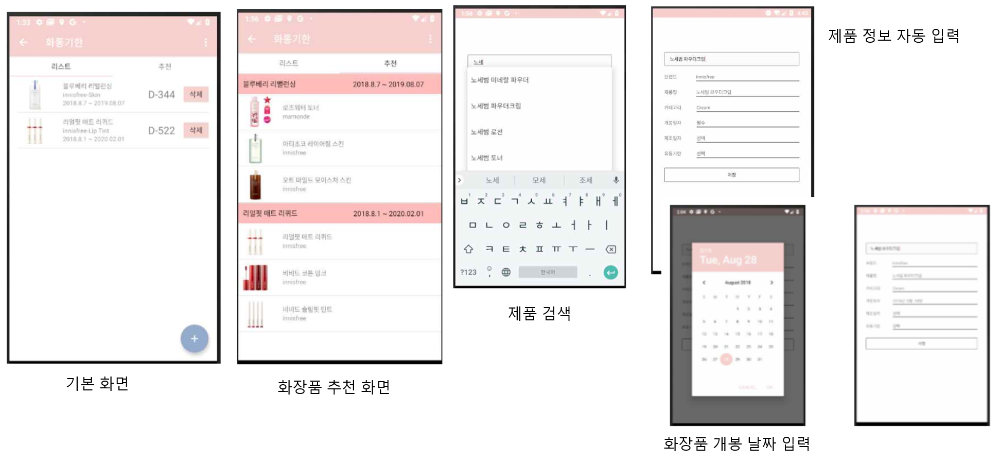

# 화통기한
- 화장품 유통기한관리 Application
- 파이어베이스에 화장품 정보와 사용자의 정보를 저장 및 관리
- 유통기한이 짧게 남은 화장품 순으로 리스트 나열

## 제품 검색
- 자동 입력 기능으로 저장되어있는 화장품명을 찾기 쉽게 리스트로 나타낸다.
- 화장품명에 따른 화장품 정보를 자동으로 채워 넣는다.

## 유통기한 관리 
- 화장품 카테고리마다 설정되어진 유통기한 기준으로 관리되어진다. 
- 화장품 개봉 날짜를 기준으로 D-day가 계산되어진다. 

## 추천 화면
- 유통기한이 10일 이하로 남은 제품에 한해서 관련 상품을 노여준다.
- 사용자의 정보에 따라 제품을 추천하는 것이 목표 (미개발)
